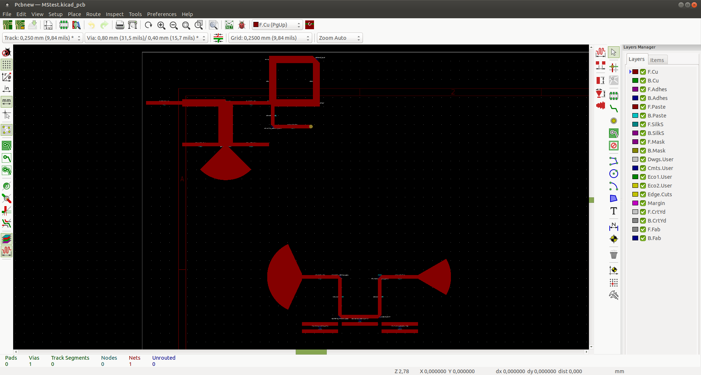
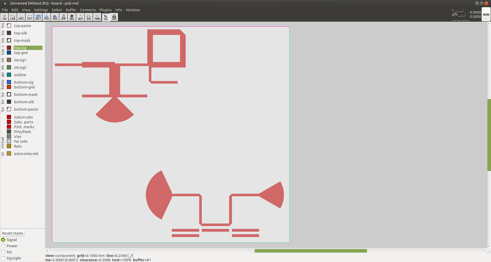

# Qucs-RFlayout
A tool to produce layouts from Qucs RF schematic (microstrip only for now)

`qucs-schematic.sch` -> `kicad-layout.kicad_pcb` [OK]

&nbsp;&nbsp;&nbsp;&nbsp;&nbsp;&nbsp;&nbsp;&nbsp;&nbsp;&nbsp;&nbsp;&nbsp;&nbsp;&nbsp;&nbsp;&nbsp;&nbsp;&nbsp;&nbsp;&nbsp;&nbsp;&nbsp;&nbsp;&nbsp;&nbsp;&nbsp;&nbsp;&nbsp;&nbsp;&nbsp;&nbsp;&nbsp;&nbsp;&nbsp;&nbsp;&nbsp;&nbsp;&nbsp;&nbsp;
-> `kicad-module.kicad_mod` [OK]

&nbsp;&nbsp;&nbsp;&nbsp;&nbsp;&nbsp;&nbsp;&nbsp;&nbsp;&nbsp;&nbsp;&nbsp;&nbsp;&nbsp;&nbsp;&nbsp;&nbsp;&nbsp;&nbsp;&nbsp;&nbsp;&nbsp;&nbsp;&nbsp;&nbsp;&nbsp;&nbsp;&nbsp;&nbsp;&nbsp;&nbsp;&nbsp;&nbsp;&nbsp;&nbsp;&nbsp;&nbsp;&nbsp;&nbsp;
-> `pcb-rnd-layout.lht` [OK]

&nbsp;&nbsp;&nbsp;&nbsp;&nbsp;&nbsp;&nbsp;&nbsp;&nbsp;&nbsp;&nbsp;&nbsp;&nbsp;&nbsp;&nbsp;&nbsp;&nbsp;&nbsp;&nbsp;&nbsp;&nbsp;&nbsp;&nbsp;&nbsp;&nbsp;&nbsp;&nbsp;&nbsp;&nbsp;&nbsp;&nbsp;&nbsp;&nbsp;&nbsp;&nbsp;&nbsp;&nbsp;&nbsp;&nbsp;
-> `openEMS-script.m` [Work in progress]

&nbsp;&nbsp;&nbsp;&nbsp;&nbsp;&nbsp;&nbsp;&nbsp;&nbsp;&nbsp;&nbsp;&nbsp;&nbsp;&nbsp;&nbsp;&nbsp;&nbsp;&nbsp;&nbsp;&nbsp;&nbsp;&nbsp;&nbsp;&nbsp;&nbsp;&nbsp;&nbsp;&nbsp;&nbsp;&nbsp;&nbsp;&nbsp;&nbsp;&nbsp;&nbsp;&nbsp;&nbsp;&nbsp;&nbsp;
-> `gmsh.geo` [ASAP]

<br>

French documentation [here](https://github.com/thomaslepoix/ESTEI/blob/master/M2_CPP_Qucs-RFlayout/Qucs-RFlayout.pdf)

<br>

## Build

```
make
```

<br>

## Usage

```
./qucsrflayout -i qucs-schematic.sch -o output-directory -f .output-format
```

<br>

## Screenshots

### Qucs : schematic.sch


### Qucs-RFlayout : preview


### Pcbnew : layout.kicad_pcb


### Pcbnew : module.kicad_mod


### Pcb-rnd : layout.lht


<br>

## Limitations

- Microstrip only for now, coplanar waveguide ASAP.
- Any other component cannot be converted into a geometric shape of metal by this tool.
- Use one wire to connect only two components ports, use apropriate components to make tees or crosses.
- Equations are not supported yet, avoid using variables in component fields.

<br>

Work in progress... thomas.lepoix@protonmail.ch
