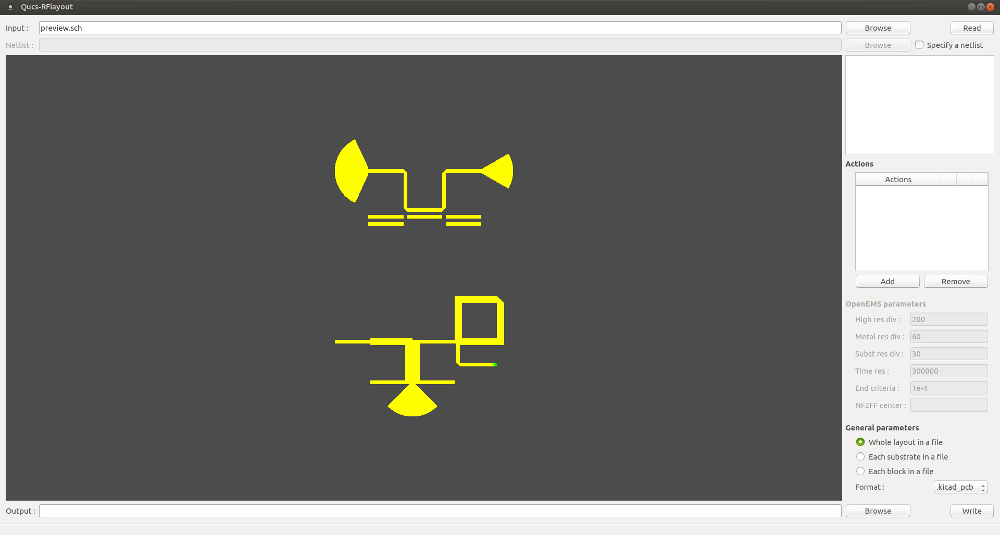
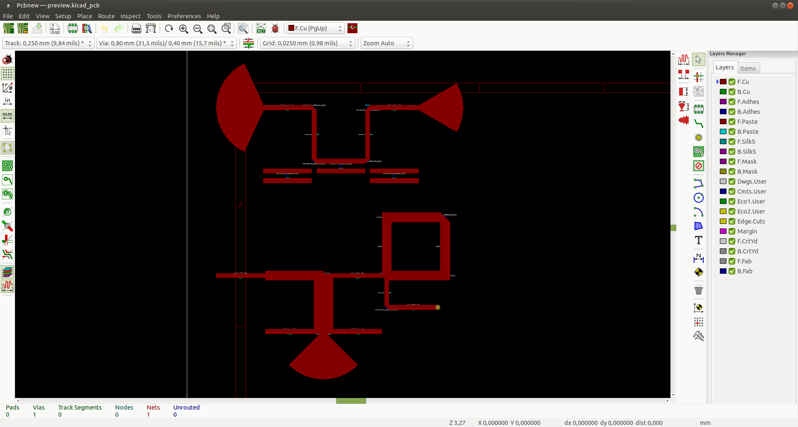

[](https://travis-ci.org/thomaslepoix/Qucs-RFlayout)
[](https://liberapay.com/thomaslepoix/donate)

# Qucs-RFlayout

A tool to produce layouts from Qucs RF schematic (microstrip only for now)

`qucs-schematic.sch` -> `kicad-layout.kicad_pcb` [OK]

&nbsp;&nbsp;&nbsp;&nbsp;&nbsp;&nbsp;&nbsp;&nbsp;&nbsp;&nbsp;&nbsp;&nbsp;&nbsp;&nbsp;&nbsp;&nbsp;&nbsp;&nbsp;&nbsp;&nbsp;&nbsp;&nbsp;&nbsp;&nbsp;&nbsp;&nbsp;&nbsp;&nbsp;&nbsp;&nbsp;&nbsp;&nbsp;&nbsp;&nbsp;&nbsp;&nbsp;&nbsp;&nbsp;&nbsp;
-> `kicad-module.kicad_mod` [OK]

&nbsp;&nbsp;&nbsp;&nbsp;&nbsp;&nbsp;&nbsp;&nbsp;&nbsp;&nbsp;&nbsp;&nbsp;&nbsp;&nbsp;&nbsp;&nbsp;&nbsp;&nbsp;&nbsp;&nbsp;&nbsp;&nbsp;&nbsp;&nbsp;&nbsp;&nbsp;&nbsp;&nbsp;&nbsp;&nbsp;&nbsp;&nbsp;&nbsp;&nbsp;&nbsp;&nbsp;&nbsp;&nbsp;&nbsp;
-> `pcb-rnd-layout.lht` [OK]

&nbsp;&nbsp;&nbsp;&nbsp;&nbsp;&nbsp;&nbsp;&nbsp;&nbsp;&nbsp;&nbsp;&nbsp;&nbsp;&nbsp;&nbsp;&nbsp;&nbsp;&nbsp;&nbsp;&nbsp;&nbsp;&nbsp;&nbsp;&nbsp;&nbsp;&nbsp;&nbsp;&nbsp;&nbsp;&nbsp;&nbsp;&nbsp;&nbsp;&nbsp;&nbsp;&nbsp;&nbsp;&nbsp;&nbsp;
-> `openEMS-script.m` [Alpha]

&nbsp;&nbsp;&nbsp;&nbsp;&nbsp;&nbsp;&nbsp;&nbsp;&nbsp;&nbsp;&nbsp;&nbsp;&nbsp;&nbsp;&nbsp;&nbsp;&nbsp;&nbsp;&nbsp;&nbsp;&nbsp;&nbsp;&nbsp;&nbsp;&nbsp;&nbsp;&nbsp;&nbsp;&nbsp;&nbsp;&nbsp;&nbsp;&nbsp;&nbsp;&nbsp;&nbsp;&nbsp;&nbsp;&nbsp;
-> `gmsh.geo` [ASAP]

<br>

French documentation [here](https://github.com/thomaslepoix/ESTEI/blob/master/M2_CPP_Qucs-RFlayout/Qucs-RFlayout.pdf)

<br>

## Screenshots

### Qucs : schematic.sch


### Qucs-RFlayout : preview


### Pcbnew : layout.kicad_pcb


### Pcbnew : module.kicad_mod


### Pcb-rnd : layout.lht


### OpenEMS : simulation.m


- Better example : A low pass filter designed, produced and measured by [F4HDG](https://wiki.rfporn.org/doku.php/wiki:projects:filtres:lpf_23cm_microstrip). Thanks to him!


 

 


- Generated scripts outputs :
    - Touchstone file (`.sxp`)
    - S parameters (Smith chart and orthogonal)
    - Feed point impedance
    - Azimuth & elevation far field radiation pattern (polar and orthogonal, normalized and in dBi)
    - 3D far field radiation pattern for multiple frequencies (animated `.gif`)
    - Electric & magnetic fields, current and current density in time domain (visible with Paraview)

- [Here](doc/tutorials/openems.md) is a tutorial.

<br>

## Binary installation

- Binary packages are available for both Linux and Windows, just checkout [releases](https://github.com/thomaslepoix/Qucs-RFlayout/releases).

- [Qucs](https://github.com/Qucs/qucs) is needed (even if you want to convert QucsStudio files), be sure it is installed and accessible from your `PATH` variable.

<br>

## Build from sources

### Linux

- Install dependencies :

```sh
sudo apt-get install qt5-default libqt5opengl5-dev texlive-xetex fonts-lato    # Debian
```

- OpenEMS scripts dependencies :

  - [OpenEMS](https://github.com/thliebig/openEMS-Project) (CTB is required, be sure to add the `addpath` lines to your `.octaverc` / `startup.m` file)
  - ImageMagick

- With CMake (You must use a modern version >= 3.11) :

```sh
Qucs-RFlayout $

    mkdir build && cd build

    cmake ..
    make
    make doc

    # Prefered way : use your packet manager
    make package
    sudo apt-get install ./qucsrflayout_*.deb    # Debian
    sudo dnf install ./qucsrflayout-*.rpm        # Fedora

    # Classic way : install manually
    sudo make install
```

- Or if you don't have CMake, you can use QMake (Incomplete installation) :

```sh
Qucs-RFlayout $

    mkdir build && cd build

    qmake ..
    make
    sudo make install
```

### Windows

- No build instructions available but it should work the regular way (CMake is prefered). You can also refer to binary installation or to the release process (cross compilation from Linux).

<br>

## Release process (using Docker)

- Windows release process is based on cross compilation within an Arch Linux container (because Arch provides several libraries for MinGW, like Qt, Boost, etc. that most other distributions does not provide).

- Unix releases process is wrapped in another container.

```sh
Qucs-RFlayout $

    sudo docker build -f pack/Dockerfile.unix . -t qucsrflayout:unix
    sudo docker build -f pack/Dockerfile.win32 . -t qucsrflayout:win32

    sudo docker run -v $PWD:/workdir/Qucs-RFlayout -t qucsrflayout:unix
    sudo docker run -v $PWD:/workdir/Qucs-RFlayout -t qucsrflayout:win32
    sudo chown -R `id -un` build
    sudo chgrp -R `id -gn` build

    ls build/out
```

<br>

## Usage

```sh
qucsrflayout -i qucs-schematic.sch -o output-directory -f .output-format
```

<br>

## Limitations

- Microstrip only for now, coplanar waveguide ASAP.
- Any other component cannot be converted into a geometric shape of metal by this tool.
- Use one wire to connect only two components ports, use apropriate components to make tees or crosses.
- Equations are not supported yet, avoid using variables in component fields.
- QucsStudio schematics are supported but it is closed source and there are some incompatibilities so please prefer using Qucs.

<br>

Work in progress... thomas.lepoix@protonmail.ch
