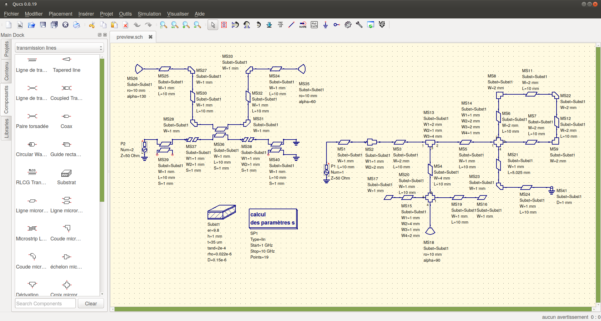

# Qucs-RFlayout
A tool to produce layouts from Qucs RF schematic (microstrip only for now)

`qucs-schematic.sch` -> `kicad-layout.kicad_pcb` [OK]

&nbsp;&nbsp;&nbsp;&nbsp;&nbsp;&nbsp;&nbsp;&nbsp;&nbsp;&nbsp;&nbsp;&nbsp;&nbsp;&nbsp;&nbsp;&nbsp;&nbsp;&nbsp;&nbsp;&nbsp;&nbsp;&nbsp;&nbsp;&nbsp;&nbsp;&nbsp;&nbsp;&nbsp;&nbsp;&nbsp;&nbsp;&nbsp;&nbsp;&nbsp;&nbsp;&nbsp;&nbsp;&nbsp;&nbsp;
-> `kicad-module.kicad_mod` [OK]

&nbsp;&nbsp;&nbsp;&nbsp;&nbsp;&nbsp;&nbsp;&nbsp;&nbsp;&nbsp;&nbsp;&nbsp;&nbsp;&nbsp;&nbsp;&nbsp;&nbsp;&nbsp;&nbsp;&nbsp;&nbsp;&nbsp;&nbsp;&nbsp;&nbsp;&nbsp;&nbsp;&nbsp;&nbsp;&nbsp;&nbsp;&nbsp;&nbsp;&nbsp;&nbsp;&nbsp;&nbsp;&nbsp;&nbsp;
-> `pcb-rnd-layout.lht` [OK]

&nbsp;&nbsp;&nbsp;&nbsp;&nbsp;&nbsp;&nbsp;&nbsp;&nbsp;&nbsp;&nbsp;&nbsp;&nbsp;&nbsp;&nbsp;&nbsp;&nbsp;&nbsp;&nbsp;&nbsp;&nbsp;&nbsp;&nbsp;&nbsp;&nbsp;&nbsp;&nbsp;&nbsp;&nbsp;&nbsp;&nbsp;&nbsp;&nbsp;&nbsp;&nbsp;&nbsp;&nbsp;&nbsp;&nbsp;
-> `openEMS-script.m` [Alpha]

&nbsp;&nbsp;&nbsp;&nbsp;&nbsp;&nbsp;&nbsp;&nbsp;&nbsp;&nbsp;&nbsp;&nbsp;&nbsp;&nbsp;&nbsp;&nbsp;&nbsp;&nbsp;&nbsp;&nbsp;&nbsp;&nbsp;&nbsp;&nbsp;&nbsp;&nbsp;&nbsp;&nbsp;&nbsp;&nbsp;&nbsp;&nbsp;&nbsp;&nbsp;&nbsp;&nbsp;&nbsp;&nbsp;&nbsp;
-> `gmsh.geo` [ASAP]

<br>

French documentation [here](https://github.com/thomaslepoix/ESTEI/blob/master/M2_CPP_Qucs-RFlayout/Qucs-RFlayout.pdf)

<br>

## Screenshots

### Qucs : schematic.sch


### Qucs-RFlayout : preview


### Pcbnew : layout.kicad_pcb


### Pcbnew : module.kicad_mod


### Pcb-rnd : layout.lht


### OpenEMS : simulation.m


- Better example : A low pass filter designed, produced and measured by [F4HDG](https://wiki.rfporn.org/doku.php/wiki:projects:filtres:lpf_23cm_microstrip). Thanks to him!


 

 


- Generated scripts outputs :
    - Touchstone file (`.sxp`)
    - S parameters
    - Feed point impedance
    - Azimuth & elevation far field radiation pattern (polar and orthogonal, normalized and in dBi)
    - 3D far field radiation pattern for multiple frequencies (animated `.gif`)
    - Electric & magnetic fields, current and current density in time domain (visible with Paraview)

<br>

## Build & Install

- Install dependencies :

```sh
sudo apt-get install qt5-default libqt5opengl5-dev texlive-xetex fonts-lato    # Debian
```

- With CMake (You must use a modern version >= 3.11) :

```sh
Qucs-RFlayout $

    mkdir build && cd build

    cmake ..
    make
    make doc

    # Prefered way : use your packet manager
    make package
    sudo apt-get install ./qucsrflayout_*.deb    # Debian
    sudo dnf install ./qucsrflayout-*.rpm        # Fedora

    # Classic way : install manually
    sudo make install
```

- Or if you don't have CMake, you can use QMake (Incomplete installation) :

```sh
Qucs-RFlayout $

    mkdir build && cd build

    qmake ..
    make
    sudo make install
```

<br>

## Usage

```sh
qucsrflayout -i qucs-schematic.sch -o output-directory -f .output-format
```

<br>

## Limitations

- Microstrip only for now, coplanar waveguide ASAP.
- Any other component cannot be converted into a geometric shape of metal by this tool.
- Use one wire to connect only two components ports, use apropriate components to make tees or crosses.
- Equations are not supported yet, avoid using variables in component fields.
- QucsStudio schematics are supported but it is closed source and there are some incompatibilities so please prefer using Qucs.

<br>

Work in progress... thomas.lepoix@protonmail.ch
